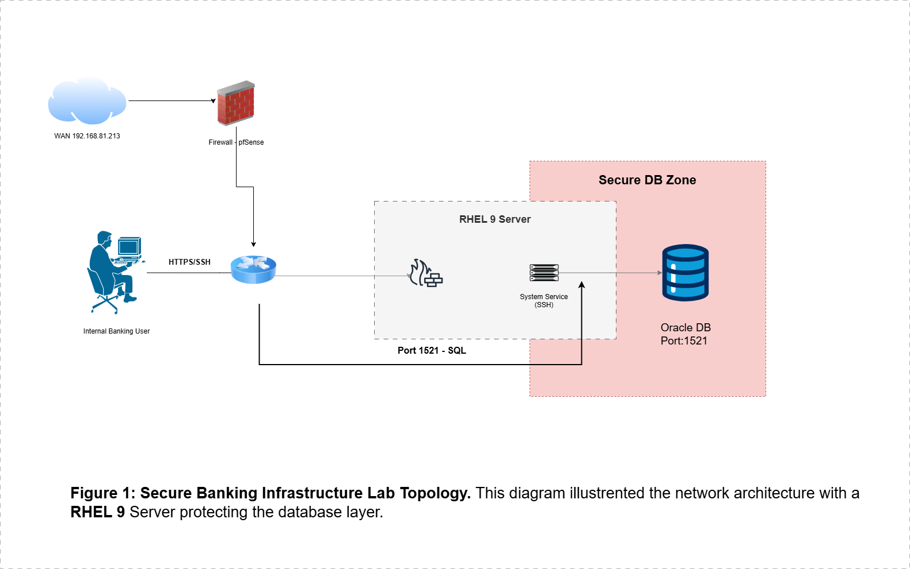

# 🏦 Secure Banking Infrastructure Lab

## 📝 Project Overview
This project demonstrates the deployment of a secure, enterprise-grade banking infrastructure using **EVE-NG**. The goal is to simulate a production-ready environment for financial services, focusing on network segmentation, advanced database security (Oracle 19c), and SWIFT CSP compliance.

---

## 🏗️ Architecture
The lab follows a **Defense-in-Depth** strategy with three distinct security zones:

* **User Zone**: Internal banking terminals (VPCS) used for auditing and database interaction.
* **Transit Zone**: Managed by a **pfSense Firewall** to control and audit all traffic flow via Port 1521.
* **Secure DB Zone**: A hardened **RHEL 9 Server** hosting the Oracle 19c Database.

> **Topology View:**
> 
> *Figure 1: Network architecture featuring a RHEL 9 Server protecting the database layer.*

---

## 🛠️ Technologies Used
* **Hypervisor**: EVE-NG.
* **Operating System**: Red Hat Enterprise Linux (RHEL) 9.
* **Firewall**: pfSense (Community Edition).
* **Database**: Oracle Database 19c Enterprise Edition.
* **Compliance Framework**: SWIFT Customer Security Programme (CSP).

---

## 🚀 Key Implementation Steps

### 1. Network & Firewall Security
* Implemented strict **LAN rules** in pfSense to allow only **SQL Port 1521** traffic to the DB server.
* Configured static IP mapping for all nodes (`192.168.1.0/24`) to ensure traceability.
* **Evidence**: [View Firewall Configuration](🛡️%20security-compliance/swift-csp-check.md).

### 2. Database Recovery & Hardening
* Resolved critical **Oracle Control File** issues during the forensic recovery phase.
* Applied automated hardening scripts to the RHEL 9 environment.
* **Evidence**: [Database Troubleshooting Log](database/troubleshooting-log.md).

### 3. Security Auditing
* Developed SQL scripts to monitor access to sensitive records such as the **Asia Corporate Account**.
* **Scripts**: [security-audit.sql](database/security-audit.sql) & [schema-setup.sql](database/schema-setup.sql).

---

## 📊 Lab Results
* **Deployment**: Database configuration (ORCLCDB) reached 100% completion successfully.
* **Security**: Infrastructure verified against **SWIFT CSP Control 2.1** for environment isolation.
* **Connectivity**: Verified secure communication from `192.168.1.20` to `192.168.1.10` via Port 1521.

---
**Created by Assia** - Cybersecurity Master's Student at UPB.
