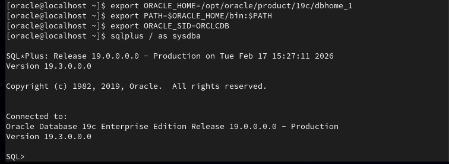
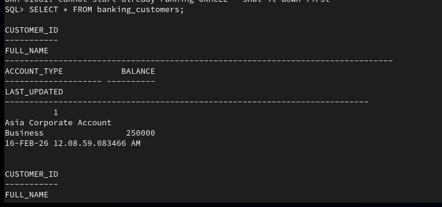
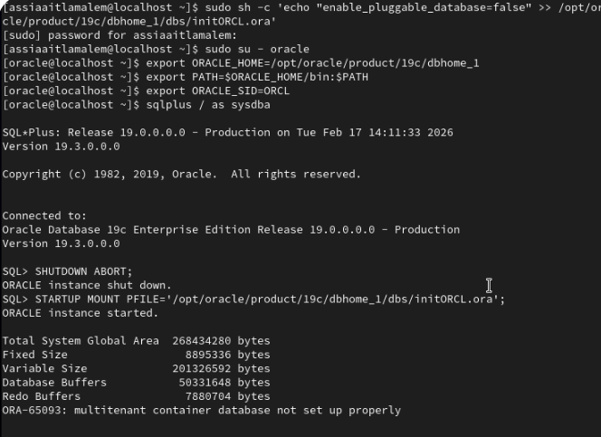

# Database Recovery & Forensic Log 🛠️

This log documents the manual recovery process of the Oracle 19c instance and the resolution of critical configuration conflicts.

## 1. Discovery Phase: Locating Lost Assets
* **Issue**: Missing Control Files prevented the database from mounting.
* **Action**: Performed a manual system-wide search using `find`.
* **Result**: Located `Seed_Database.ctl` in the templates directory.
* **Evidence**:
 

## 2. Configuration Phase: Fixing Naming Conflicts
* **Issue**: The system expected SID `ORCL`, but the Control File was hardcoded for `SEEDDATA`.
* **Action**: Manually updated the `PFILE` (`initORCL.ora`) to match the internal DB name.
* **Evidence**:
  

## 3. Advanced Troubleshooting: Multitenant Errors
* **Issue**: Encountered `ORA-65093` due to improper Multitenant setup in the lab environment.
* **Action**: Reconfigured instance parameters to bypass container conflicts and forced a clean startup.
* **Evidence**:
  
 
## 4. Final Victory: Data Extraction
* **Success**: Successfully mounted and opened the database under `ORCLCDB`.
* **Output**: Extracted real-time banking records for audit.
* **Final Proof**:
 
