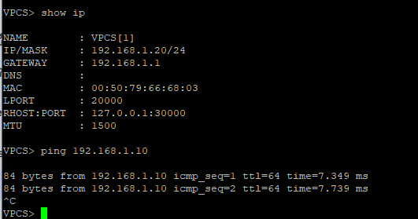

# 🖥️ VPC Setup & Client Connectivity

This document details the configuration of the internal banking terminals used for auditing and database interaction.

---

## 📍 1. Client Configuration (VPCS)
The **Internal-Banking-User** node was configured to reside within the **192.168.1.0/24** subnet, allowing it to communicate with the application layer through the central switch.

| Parameter | Configuration Value |
| :--- | :--- |
| **Device Name** | Internal-Banking-User |
| **IP Address** | `192.168.1.20` |
| **Subnet Mask** | `255.255.255.0` |
| **Default Gateway** | `192.168.1.1` (pfSense LAN) |

---

## 📟 2. IP Assignment Verification
To ensure the client was correctly provisioned within the network topology, we verified the IP assignment directly on the terminal.

> **Evidence Log:**
> 

> *The terminal output confirms the IP is active and unique within the LAN.*

---

### 🛰️ 3. Network Path Validation
The connection flow follows a structured path through the infrastructure:
* **Logical Path**: `VPCS` ➡️ `Switch (Gi0/2)` ➡️ `RHEL 9 Server (Gi0/1)`.
* **Connectivity Test**: A ping was performed to the gateway (`192.168.1.1`) and the DB server (`192.168.1.10`).
* **Security Check**: Firewall rules monitored to ensure Port **1521 (SQL)** was reachable.

---

### 🏆 4. Final Audit Result
Once connectivity was established, the VPC was used to execute the final security audit.

* **Success**: The user successfully retrieved sensitive records from the Oracle instance.
